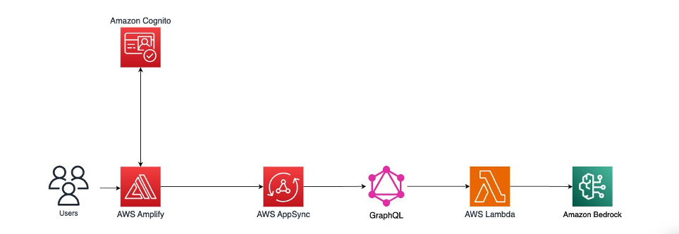
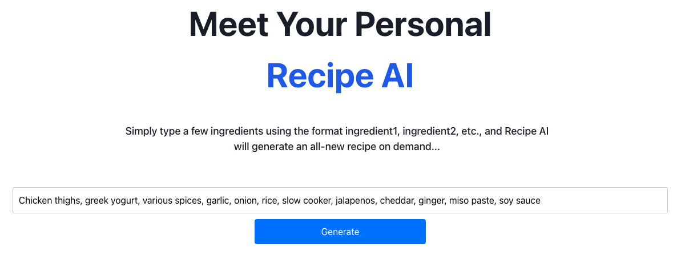

---

# Building a Serverless Web App with AWS Amplify, Lambda, and Amazon Bedrock

Serverless computing enables scalable, cost-efficient applications without the overhead of managing infrastructure. This project demonstrates how to build a **serverless AI-powered recipe web app** using AWS services, leveraging **Amazon Bedrock’s Claude 3 Sonnet** model for recipe generation.

## Why Serverless?
- **Cost Efficiency** – Charges are based on actual usage, with no idle resource costs.
- **Scalability** – Serverless functions scale dynamically based on demand.
- **Faster Development** – Reduces time spent on infrastructure management.

---

## Architecture Overview

| **Component**        | **AWS Service**                     | **Purpose**  |
|----------------------|-------------------------------------|--------------|
| **Frontend**        | AWS Amplify                         | Hosting, CI/CD |
| **Authentication**  | Amazon Cognito                      | User management |
| **Backend API**     | AWS AppSync (GraphQL)               | Data retrieval |
| **Serverless Logic**| AWS Lambda                          | AI processing |
| **AI Processing**   | Amazon Bedrock (Claude 3 Sonnet)    | AI model for recipes |
| **Security**        | AWS IAM                             | Access control |

This **AWS-driven architecture** ensures that the system remains **highly available, cost-effective, and scalable**.

---

## **Project Implementation**

### **1️⃣ Hosting a Static Frontend with AWS Amplify**
AWS Amplify was used to host a **React-based frontend**, enabling **continuous deployment (CI/CD) through GitHub integration**. Amplify simplifies frontend hosting by providing:

✅ **Automatic builds & deployments** upon each Git push

✅ **A global CDN** for optimized performance

✅ **Integrated authentication** with Cognito

### **2️⃣ Securing User Authentication with Amazon Cognito**
The app requires users to sign in before accessing AI-generated recipes. **Amazon Cognito** was used to manage authentication, offering:

✅ **Multi-factor authentication (MFA)**

✅ **OAuth & social login options**

✅ **IAM-based role management**

### **3️⃣ Implementing a Serverless Backend with AWS Lambda**
The core of this system is a **Lambda function** that:
- Accepts user-submitted ingredients.
- Generates a structured prompt for AI processing.
- Calls **Amazon Bedrock’s Claude 3 Sonnet** model to generate recipes.
- Returns a structured response to the frontend.

This **serverless approach eliminates infrastructure overhead**, ensuring **high availability and auto-scaling**.

### **4️⃣ Deploying a GraphQL API with AWS AppSync**
Instead of REST, **GraphQL via AWS AppSync** was used to optimize data retrieval.

🔹 **Why GraphQL?**
- **Efficient data fetching** (fetches only required fields).
- **Real-time data updates**.
- **Improved API performance & flexibility**.

### **5️⃣ Frontend-Backend Integration**
The frontend was configured to:

✅ **Authenticate users with Cognito**.

✅ **Send queries to AppSync via GraphQL**.

✅ **Display AI-generated recipes dynamically**.

### **6️⃣ Cloud Resource Optimization & Cost Management**
To **prevent unnecessary charges**, I implemented best practices for AWS cost management:

✅ **Resource cleanup upon project completion**.

✅ **IAM roles for fine-grained access control**.

✅ **Event-driven Lambda execution (pay-per-use model)**.

---

## **Key Takeaways**

✅ **Hands-on experience building a production-ready serverless application**.

✅ **Deep understanding of AWS cloud architecture, security, and cost management**.

✅ **Practical application of AI-driven workflows in cloud environments**.

✅ **Strong grasp of AWS services, including Amplify, Cognito, Lambda, AppSync, and Bedrock**.

✅ **Ability to deploy and manage cloud applications following DevOps best practices**.

---

## **Looking Ahead**
This project is a **real-world demonstration of cloud-native AI applications**. Potential enhancements include:
- **AI-driven personalized meal planning**.
- **Real-time recommendations based on user preferences**.
- **Serverless microservices for expanded features**.

I’m passionate about **cloud engineering, DevOps, and AI-driven solutions**. If you're hiring for **Cloud Engineer, DevOps, or AWS Solutions Architect** roles, let's connect!

📩 Open to discussions on AWS, serverless architectures, and AI integration in cloud environments.

---

